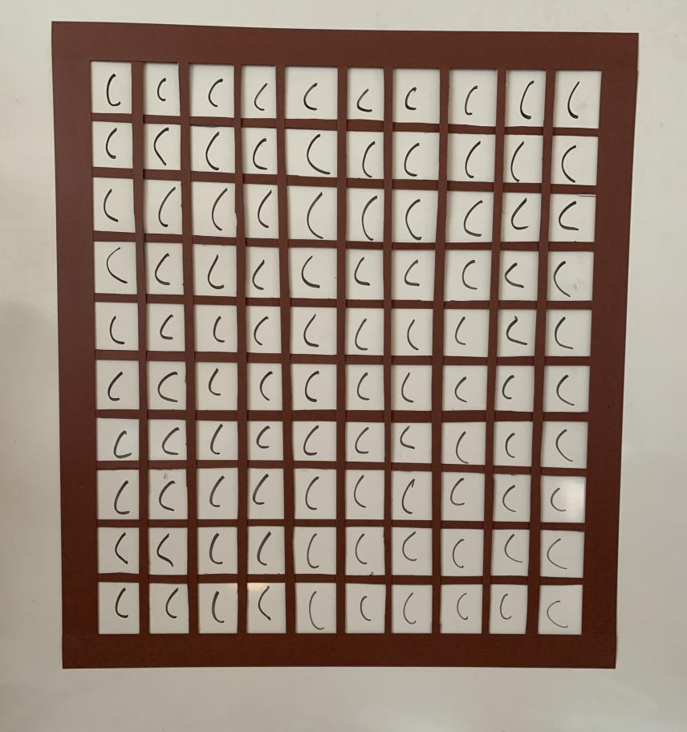
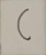

# whiteboard parser
This project is intended to gather your own data

Reads a picture of a whiteboard with a grid on it and parses the the symbol in the cells. It returns a gathered_data.csv. Each row has an array of pixel values and the last element of the row has the class. (same format as the mnist dataset, which I inted to append this data too)



`python whiteboard_parse.py '<CHARACTER>' <PATH_TO_IMAGE>`

the imageparse program was inspired by [Sudoku_ai](https://github.com/Joy2469/Sudoku_AI.git), although extremely different now, looking at this project made me think about analyzing cells in a grid. Past iterations of this project used programs from sudoku AI but now that is not the case. 


## requirements
`pip install -r requirements.txt`

## usage
This is only tested on linux. if it works on other platforms let me know.

I got a little crafty with the grid. However it should work with more simple grids.

### get the program and move into directory

```
git clone https://github.com/DrAtomic/whiteboard_parse.git
cd whiteboard_parse
```
### test the program

To test this program run

`python whiteboard_parse.py '(' image0.jpg`

This will produce outputs in "/cell_images/"
for example 


You can look at these in the cell_images directory. Just look at all the C's! its a sea of C's

next the program will resize the images to  28x28 and append those pixels into "data/gathered_data.csv"

You can visualize an image added to this csv by running `python vismnist.py`

This dataset can (hopefully) be appended to the [mnist dataset](http://yann.lecun.com/exdb/mnist/) 
